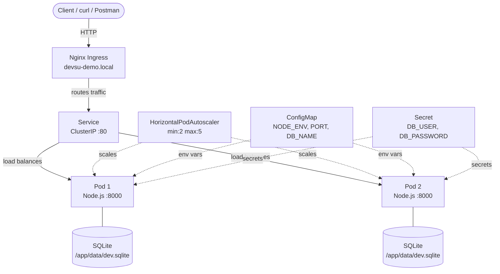
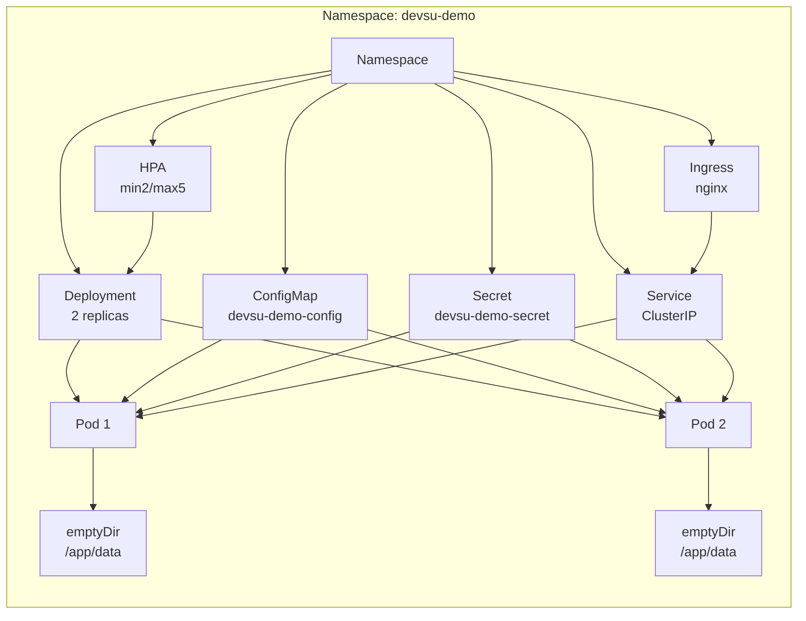
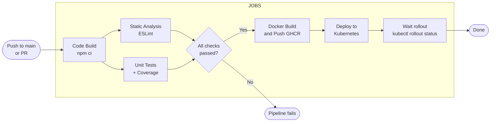
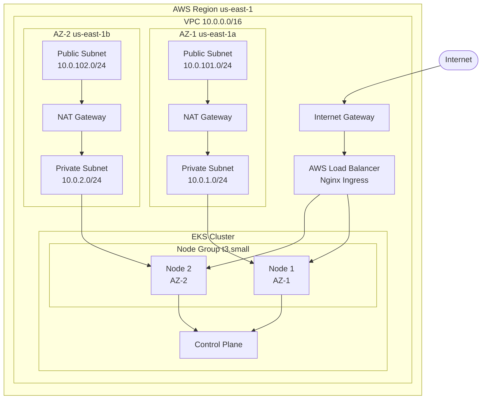

# Devsu Demo DevOps — Node.js

> **DevOps Technical Test** — Erick Mancera  
> Stack: Node.js 18.15.0 · Express 4.18.2 · SQLite · Docker · Kubernetes · GitHub Actions

## Table of Contents

- [Overview](#overview)
- [Architecture Diagrams](#architecture-diagrams)
- [CI/CD Pipeline](#cicd-pipeline)
- [Kubernetes Setup](#kubernetes-setup)
- [Running Locally](#running-locally)
- [Running with Docker](#running-with-docker)
- [Deploying to Kubernetes](#deploying-to-kubernetes)
- [API Reference](#api-reference)
- [Design Decisions](#design-decisions)

---

## Overview

REST API for user management with three endpoints: list users, get user by ID, and create user. The app uses SQLite as the database (file-based), Sequelize as the ORM, and Express as the HTTP framework.

---

## Architecture Diagrams

### Application Architecture



### Kubernetes Resource Map



---

## CI/CD Pipeline

### Pipeline Flow



### Pipeline Steps Detail

| Step | Tool | Trigger |
|------|------|---------|
| Code Build | `npm ci` | All branches |
| Static Code Analysis | ESLint | All branches |
| Unit Tests | Jest | All branches |
| Code Coverage | Jest `--coverage` (>=70% lines) | All branches |
| Docker Build & Push | Docker Buildx -> GHCR | `push` to `main` only |
| Deploy to Kubernetes | `kubectl apply -f k8s/` | `push` to `main` only |

### Required GitHub Secrets

| Secret | Description |
|--------|-------------|
| `GITHUB_TOKEN` | Auto-provided by GitHub — used for GHCR push |
| `KUBECONFIG` | Base64-encoded kubeconfig for the target cluster |

---

## Kubernetes Setup

### Prerequisites

- [kubectl](https://kubernetes.io/docs/tasks/tools/) configured against your cluster
- [minikube](https://minikube.sigs.k8s.io/docs/start/) or Docker Desktop with K8s enabled (for local)
- Nginx Ingress Controller installed

```bash
# Install nginx ingress on minikube
minikube addons enable ingress

# Or on a generic cluster
kubectl apply -f https://raw.githubusercontent.com/kubernetes/ingress-nginx/main/deploy/static/provider/cloud/deploy.yaml
```

### Resource Files

```
k8s/
├── namespace.yaml    # Namespace: devsu-demo
├── configmap.yaml    # Non-sensitive env vars
├── secret.yaml       # DATABASE_USER, DATABASE_PASSWORD (base64)
├── deployment.yaml   # 2 replicas, probes, resource limits, emptyDir
├── service.yaml      # ClusterIP on port 80 -> 8000
├── ingress.yaml      # Nginx ingress: devsu-demo.local
└── hpa.yaml          # HPA: min 2, max 5, CPU 70%
```

### Manual Deploy

```bash
kubectl apply -f k8s/namespace.yaml
kubectl apply -f k8s/configmap.yaml
kubectl apply -f k8s/secret.yaml

# Replace IMAGE_PLACEHOLDER with real image tag before applying
sed -i "s|IMAGE_PLACEHOLDER|ghcr.io/YOUR_USER/devsu-demo-devops-nodejs:latest|g" k8s/deployment.yaml

kubectl apply -f k8s/deployment.yaml
kubectl apply -f k8s/service.yaml
kubectl apply -f k8s/ingress.yaml
kubectl apply -f k8s/hpa.yaml

# Verify
kubectl get all -n devsu-demo
```

### Add local DNS entry (for minikube)

```bash
# Get minikube IP
minikube ip  # e.g. 192.168.49.2

# Add to /etc/hosts
echo "192.168.49.2  devsu-demo.local" | sudo tee -a /etc/hosts

# Test
curl http://devsu-demo.local/api/users
```

---

## Running Locally

### Prerequisites

- Node.js 18.15.0

```bash
# Install dependencies
npm install

# Run tests
npm test

# Run tests with coverage
npm run test:coverage

# Lint
npm run lint

# Start server
npm start
```

Open http://localhost:8000/api/users

---

## Running with Docker

```bash
# Build image
docker build -t devsu-demo-nodejs:local .

# Run with docker-compose (recommended)
docker-compose up

# Run standalone
docker run -p 8000:8000 \
  -e DATABASE_USER=user \
  -e DATABASE_PASSWORD=password \
  -e DATABASE_NAME=/app/data/dev.sqlite \
  devsu-demo-nodejs:local
```

---

## API Reference

Base URL: `http://localhost:8000/api`

| Method | Endpoint | Description |
|--------|----------|-------------|
| GET | `/users` | List all users |
| GET | `/users/:id` | Get user by ID |
| POST | `/users` | Create new user |

### Create User

```bash
curl -X POST http://localhost:8000/api/users \
  -H "Content-Type: application/json" \
  -d '{"dni": "123456789", "name": "Erick Mancera"}'
```

Response `201`:
```json
{ "id": 1, "dni": "123456789", "name": "Erick Mancera" }
```

---

## Design Decisions

### SQLite in Kubernetes

SQLite is a file-based database, which presents limitations in a Kubernetes environment:

- **No shared state between pods** — each pod has its own `emptyDir` volume, so data is not shared across replicas. For a production system this would need to be replaced with PostgreSQL or MySQL using a StatefulSet or an external managed DB.
- **Data is ephemeral** — `emptyDir` volumes are cleared on pod restart. A `PersistentVolumeClaim` would be needed for production data durability.
- **Why kept for this test** — the exercise focuses on DevOps practices (Docker, CI/CD, K8s), not the database architecture. The SQLite limitation is noted as a known trade-off.

### Docker Multi-stage Build

The Dockerfile uses two stages:
1. `deps` — installs only production dependencies
2. `runtime` — copies the app and runs it as a non-root user

This keeps the final image lean and secure.

### HPA Configuration

- `minReplicas: 2` — always maintain high availability
- `maxReplicas: 5` — cap scaling to control costs
- CPU target: 70%, Memory target: 80%
- Scale-down stabilization: 180s to avoid flapping

### Security Practices

- Container runs as non-root user (`appuser`, UID 1001)
- All Linux capabilities dropped at container level
- Secrets stored in K8s Secrets, not hardcoded in ConfigMaps or the image
- `.dockerignore` excludes `.env`, test files, and `node_modules` from the build context

---

## License

Copyright © 2023 Devsu. All rights reserved.

---

## Terraform (IaC — Bonus)

The `terraform/` directory provisions the complete AWS infrastructure using Terraform.

### What it creates

| Resource | Count | Notes |
|----------|-------|-------|
| VPC | 1 | CIDR 10.0.0.0/16 |
| Public Subnets | 2 | One per AZ — for load balancers |
| Private Subnets | 2 | One per AZ — for worker nodes |
| NAT Gateways | 2 | One per AZ for HA egress |
| Internet Gateway | 1 | Public internet access |
| EKS Cluster | 1 | Kubernetes 1.28 |
| EKS Node Group | 1 | t3.small, min 2 / max 5 |
| IAM Roles | 2 | Control plane + node group |
| OIDC Provider | 1 | Enables IRSA |
| Nginx Ingress (Helm) | 1 | Via helm_release |
| K8s Namespace | 1 | devsu-demo |
| K8s ConfigMap | 1 | App config |
| K8s Secret | 1 | DB credentials |
| K8s Deployment | 1 | 2 replicas |
| K8s Service | 1 | ClusterIP |
| K8s Ingress | 1 | Nginx |
| K8s HPA | 1 | min 2, max 5 |

**Total: 33 resources**

### Infrastructure Diagram



### Quick Start

```bash
cd terraform

# 1. Copy and edit variables
cp terraform.tfvars.example terraform.tfvars
# Edit app_image, aws_region, db_password, etc.

# 2. Initialize providers
terraform init

# 3. Review what will be created
terraform plan \
  -var="db_user=user" \
  -var="db_password=your-secure-password"

# 4. Apply (creates ~33 resources, takes ~12 min)
terraform apply \
  -var="db_user=user" \
  -var="db_password=your-secure-password"

# 5. Configure kubectl
aws eks update-kubeconfig --region us-east-1 --name devsu-demo-cluster

# 6. Verify
kubectl get all -n devsu-demo

# Destroy when done (avoids AWS costs)
terraform destroy \
  -var="db_user=user" \
  -var="db_password=your-secure-password"
```

### Required GitHub Secrets (for Terraform workflow)

| Secret | Description |
|--------|-------------|
| `AWS_ACCESS_KEY_ID` | AWS IAM access key |
| `AWS_SECRET_ACCESS_KEY` | AWS IAM secret key |
| `DB_USER` | SQLite DB user (passed as TF var) |
| `DB_PASSWORD` | SQLite DB password (passed as TF var) |

See `docs/terraform-apply-output.txt` for a sample execution output.
